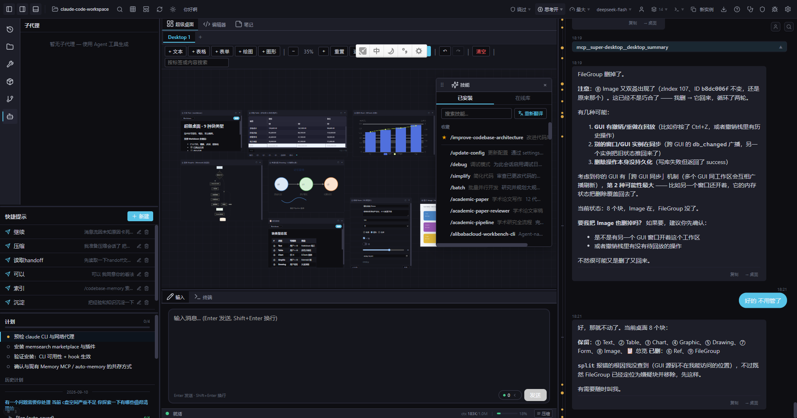
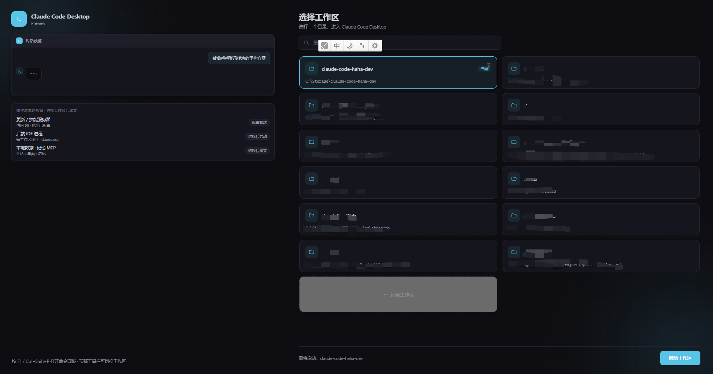

# Claude Code Haha

<p align="right"><a href="./README.md">中文</a> | <strong>English</strong></p>

A **locally-runnable version** of Claude Code, repaired from the leaked source — with a **full desktop GUI client** (Tauri 2 + React) built on top.

Works with any Anthropic-compatible API (DeepSeek, Qwen, MiniMax, OpenRouter, …).

> The leaked source does not run as-is. This repo fixes several startup blockers and adds a graphical interface plus a plugin ecosystem that the original never had.

<p align="center">
  
  <br><sub>Multi-panel workbench: sub-agents / Super Desktop / skills / quick prompts / plan / chat / input / terminal</sub>
</p>

<p align="center">
  
  <br><sub>Launcher: pick or create a workspace</sub>
</p>

---

## Desktop GUI (primary form)

The original Claude Code is a terminal program. This project keeps the TUI **and** provides a desktop client — a **multi-panel workbench** that lays out what the terminal renders linearly, into panels you can freely arrange: chat, editor, terminal, and file tree side by side, splittable and floatable.

### Panels

| Panel | Description |
|-------|-------------|
| **Editor** | Monaco editor; image/PDF/SVG preview (wheel zoom, drag pan, color picker) |
| **Chat** | Message stream + history; message timeline (jump by your own prompts), search, reference links |
| **Terminal** | Multi-tab xterm.js terminal — the agent's Bash output renders here |
| **Files** | File tree (create/rename/delete, context menu, reveal in editor) |
| **Super Desktop** | Infinite canvas: 9 block types (text/table/chart/graphic/drawing/form/image/ref/file-group), connectable, zoomable, AI-collaborative |
| **Skills / Plugin Market** | Install skills and plugins online; plugins can contribute panels, commands, background processes |
| **Notes** | Personal notes with tags, scopes, and associations (shared across workspaces) |
| **Plan / Sub-agents / Workers** | TodoWrite task view, background agent list with transcripts, plugin process status |
| **Diagnostics** | One-click check & repair for backend service/port/connection/env |
| **Settings / Updates** | Model & API profiles, theme, language, component updates |

### Features

- **Free layout** — drag to rearrange, split into groups, float into separate windows; layout persists per workspace
- **Multi-instance** — several windows bound to different workspaces; session list / notes / settings sync across windows
- **Multi-model profiles** — built-in DeepSeek / Qwen presets; config shared with the CLI
- **Plugin ecosystem** — zip-distributed, one-click install; panels (sandboxed iframe), slash commands, background processes, runtime deps
- **Deep AI integration** — the AI drives the GUI over MCP (canvas blocks, notes, git inspection, plugin installs)
- **Theming** — dark/light, UI font scaling

### Stack

| Layer | Tech |
|-------|------|
| Shell | [Tauri 2](https://tauri.app) (Rust + WebView2) |
| Frontend | React 18 + TypeScript + Vite |
| Editor | Monaco |
| Terminal | xterm.js |
| Table / Chart | AG Grid / ECharts |
| Runtime | Bun (engine side) |

---

## Quick Start

### Option A: Installer (recommended)

Run `ClaudeCodeHaha_Setup_*.exe` and follow the wizard. You can configure an API profile during setup.

See [SETUP.md](./SETUP.md) (Chinese).

### Option B: From source

```bash
# 1. Install Bun
curl -fsSL https://bun.sh/install | bash          # macOS / Linux
powershell -c "irm bun.sh/install.ps1 | iex"      # Windows

# 2. Install dependencies
bun install
cd gui && bun install && cd ..

# 3. Configure API
cp .env.example .env    # fill in ANTHROPIC_API_KEY or ANTHROPIC_AUTH_TOKEN

# 4. Launch the GUI (dev mode)
cd gui && cargo tauri dev
```

> **Windows prerequisite**: [Git for Windows](https://git-scm.com/download/win) (provides Git Bash; shell execution depends on it).

> The **skill / plugin marketplace** needs a reachable registry (the address is configurable in Settings). It defaults to the developer's LAN address — on the public internet, point it at your own deployment. An unreachable marketplace does not affect any other feature.

---

## Terminal TUI Mode

The original form remains fully functional — the same Ink interface as official Claude Code:

```bash
# macOS / Linux
./bin/claude-haha                    # interactive TUI
./bin/claude-haha -p "your prompt"   # headless (scripts/CI)

# Windows (PowerShell / cmd)
bun --env-file=.env ./src/entrypoints/cli.tsx
bun --env-file=.env ./src/entrypoints/cli.tsx -p "your prompt"
```

---

## Environment Variables

| Variable | Required | Description |
|----------|----------|-------------|
| `ANTHROPIC_API_KEY` | one of two | API key sent via `x-api-key` |
| `ANTHROPIC_AUTH_TOKEN` | one of two | Auth token sent via `Authorization: Bearer` |
| `ANTHROPIC_BASE_URL` | no | Custom endpoint (default: Anthropic) |
| `ANTHROPIC_MODEL` | no | Default model |
| `ANTHROPIC_DEFAULT_SONNET_MODEL` | no | Sonnet-tier mapping |
| `ANTHROPIC_DEFAULT_HAIKU_MODEL` | no | Haiku-tier mapping |
| `ANTHROPIC_DEFAULT_OPUS_MODEL` | no | Opus-tier mapping |
| `API_TIMEOUT_MS` | no | Request timeout, default 600000 (10 min) |
| `DISABLE_TELEMETRY` | no | Set `1` to disable telemetry |
| `CLAUDE_CODE_DISABLE_NONESSENTIAL_TRAFFIC` | no | Set `1` to disable non-essential requests |

In the GUI these are managed via the settings panel / profiles — no need to edit `.env` by hand.

---

## Project Structure

```
gui/                     # Desktop client (the main addition in this repo)
├── src/                 #   React frontend
│   ├── components/      #     panels & UI components
│   ├── stores/          #     state (layout/sessions/desktop/notes…)
│   ├── services/        #     bridges (Tauri commands, MCP, cross-window)
│   └── i18n/            #     zh/en strings
└── src-tauri/           #   Rust backend (windows, files, processes, plugins, DB)

src/                     # Engine (repaired from the leaked source)
├── entrypoints/         #   CLI entrypoints (cli.tsx / ideMode.ts)
├── main.tsx             #   TUI core (Commander.js + React/Ink)
├── tools/               #   Agent tools (Bash/Edit/Grep…)
├── commands/            #   Slash commands
├── skills/              #   Skill system
├── services/            #   Service layer (API/MCP/OAuth…)
└── utils/               #   Utilities

plugins/                 # Official plugins (+ _template/ scaffolding & doc conventions)
extensions/              # IDE plugins (VS Code / VS / IntelliJ) + memory service
installer/               # Installer (Inno Setup)
docs/                    # Diagrams & developer docs
bin/claude-haha          # Entry script
preload.ts               # Bun preload (sets MACRO globals)
```

---

## Development

```bash
# GUI dev (hot reload)
cd gui && cargo tauri dev

# GUI tests / typecheck
cd gui && npm test && npx tsc --noEmit

# Engine (TUI)
bun --env-file=.env ./src/entrypoints/cli.tsx

# Fallback recovery CLI (when the TUI misbehaves)
bun --env-file=.env ./src/localRecoveryCli.ts
```

Architecture docs live in [docs/](./docs/) (`ARCHITECTURE.md` and the `gui/` topic docs).

---

## Building

All artifacts land in `dist/`, driven by `scripts/build.ts` (compile components → assemble dist → optionally generate update packages).

```bash
# Full build (engine + GUI + CLI tools + embedded runtimes → dist/)
bun run scripts/build.ts

# Rebuild only selected components (reuse other zips from the previous release — much faster)
bun run scripts/build.ts --components gui,claude
#   available: gui, server, claude, bun, updater, tools, python, git, extensions

# Skip steps whose output already exists (for repeated local iteration)
bun run scripts/build.ts --quick

# Generate an update package: manifest + per-component zips → dist/release/<version>/
bun run scripts/build.ts --release 2026.09.10.14 --notes "v2026.09.10.14

### Fixes
- One line on what changed — and why"
```

Output layout:

```
dist/
├── claude.exe / claude-code-gui.exe / claude-gui-server.exe / …   # components
├── bin/                          # CLI tools (rg / fd / jq / yq / shellcheck)
└── release/<version>/
    ├── manifest.json             # update manifest (version + per-component sha256)
    └── <component>.zip           # per-component update packages (GUI updates by sha)
```

### Building the installer

```powershell
# Requires Inno Setup 6+ (https://jrsoftware.org/isdl.php)
cd installer
./build.ps1            # derives a "YYYYWww" build tag automatically; -Quick skips the version prompt
```

Produces `dist/ClaudeCodeHaha_Setup_<version>_<buildTag>.exe` (wizard with component selection, PATH, API profile setup).

> **Distribution**: update packages and the skill/plugin marketplace both need a compatible registry / update service (`GET /api/updates/latest`, `POST /api/updates/<version>/upload`). No server implementation ships with this repo — self-host one, or substitute your own publishing flow. The full packaging + upload walkthrough (including Windows/macOS differences) lives in `docs/windows-build-playbook.md` / `docs/macos-build-playbook.md`.

---

## Fixes Over the Leaked Source

The leaked source does not run directly. Main repairs:

| Problem | Root cause | Fix |
|---------|-----------|-----|
| TUI won't start | Entry routed no-arg launch to the recovery CLI | Restored the full `cli.tsx` entrypoint |
| Startup hang | `verify` skill imported a missing `.md`; Bun's text loader hung | Added stub `.md` files |
| `--print` hang | `filePersistence/types.ts` missing | Added type stub |
| `--print` hang | `ultraplan/prompt.txt` missing | Added resource stub |
| **Enter key unresponsive** | `modifiers-napi` native package missing; `isModifierPressed()` threw, breaking `handleEnter` | Wrapped in try-catch |
| Setup skipped | `preload.ts` unconditionally set `LOCAL_RECOVERY=1` | Removed the default |
| Compiled binary can't find ripgrep | `bun build --compile` doesn't embed `vendor/ripgrep/` | Multi-path runtime lookup |

---

## Disclaimer

This repository is based on Claude Code source code leaked from the Anthropic npm registry on 2026-03-31. All original source code copyright belongs to [Anthropic](https://www.anthropic.com). For learning and research purposes only.
